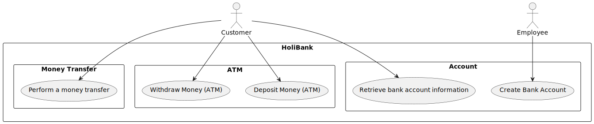
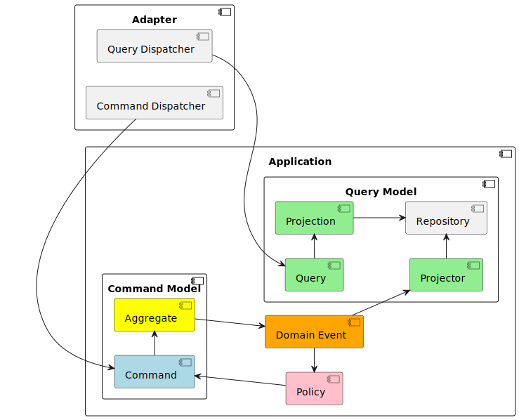
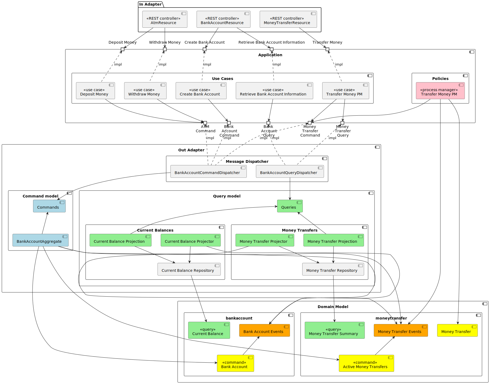

# Axon Framework Example

## Business Context

This application is a small example to demonstrate the usage of Axon Framework in a self-contained
system constructed following principles of DDD, Clean Architecture and CQRS/ES.

## Use Cases 

### UC-001 Create Bank Account

A customer can apply for a new bank account. The account has an account id, serving as a primary
account identifier. Initial balance must be deposited during account creation. The bank 
has constraints regarding the account balance (minimum balance and maximum balance).

### UC-002 Deposit Money (ATM)

A customer can use an ATM to deposit money to the bank account. To run this use case, he/she needs
the account id and the amount of money to be deposited. Usual account constraints are applied, resulting in
errors on violations.

### UC-003 Withdraw Money (ATM)

A customer can use an ATM to withdraw money from the bank account. To run this use case, he/she needs
the account id and the amount of money to be withdrawn. Usual account constraints are applied, resulting in
errors on violations.

### UC-004 Perform a money transfer

A customer can initialize a money transfer between two accounts. To run this use case, he/she needs 
the account id of the source and the target account and the amount of money to transfer. Usual account 
constraints are applied for both accounts, resulting in errors on violations. Since the money transfer 
can't be executed in an atomic way, the money is first reserved on the first account, then received on the 
second account and then confirmed for the first account. On any errors, the money transfer is cancelled
and the reservation on the source account is reset.

A customer can query information about money transfers identifying the latter by the unique id or by quering
all money transfers in which an account was involved as a source or as a target.

### UC-005 Retrieve bank account information

A customer can retrieve account information. To run this use case, he/she needs the account id.

## Overall CQRS idea

## Component diagram

## Domain Model (command side)

## ADRs (Architecture Decision Records)

- [Clean Architecture](./documentation/adrs/001-clean-architecture.md)
- [Ubiquitous Language](./documentation/adrs/002-ubiquituos-language.md)
- [CQRS](./documentation/adrs/003-cqrs.md)
- [Event Sourcing](./documentation/adrs/004-event-sourcing.md)
- [Explicit Messaging](./documentation/adrs/005-command-event-query-bus.md)
- [In and Out Ports](./documentation/adrs/006-in-and-out-ports.md)

## Running Example

The example can be started by running the `HexagonalAxonBankApplication`. It supports
two spring profiles (configured via `application.yml`). The `mem` profile 
works with an in-memory Event Store. If `no-mem` profile is active, the 
application requires an Axon Server, which can be started by starting 
docker compose with the corresponding `docker-compose.yaml` file. 

To interact with application, use Swagger UI available via http://localhost:8081/swagger-ui/index.html
It provides several use cases switchable via group selection on the top of the UI. 
